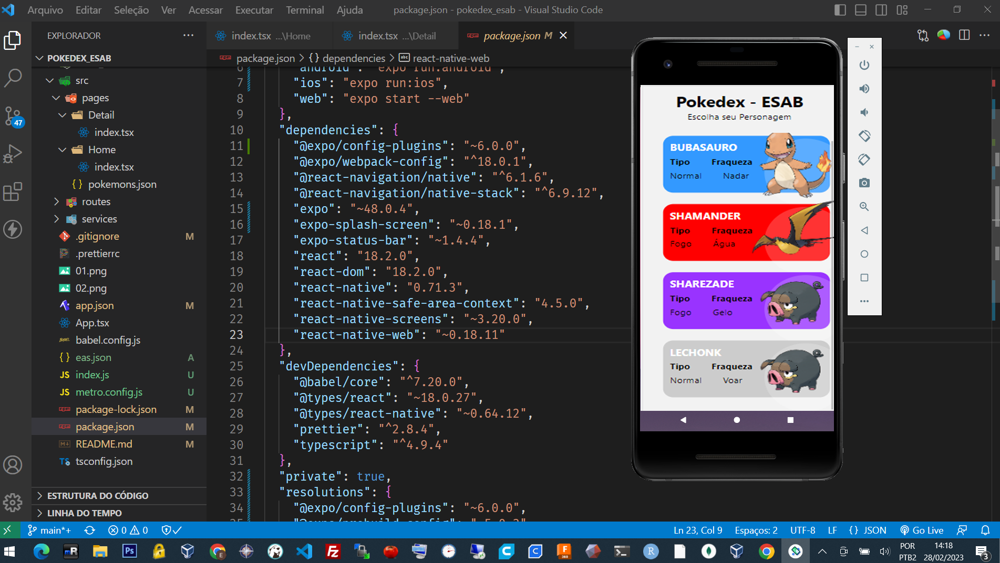
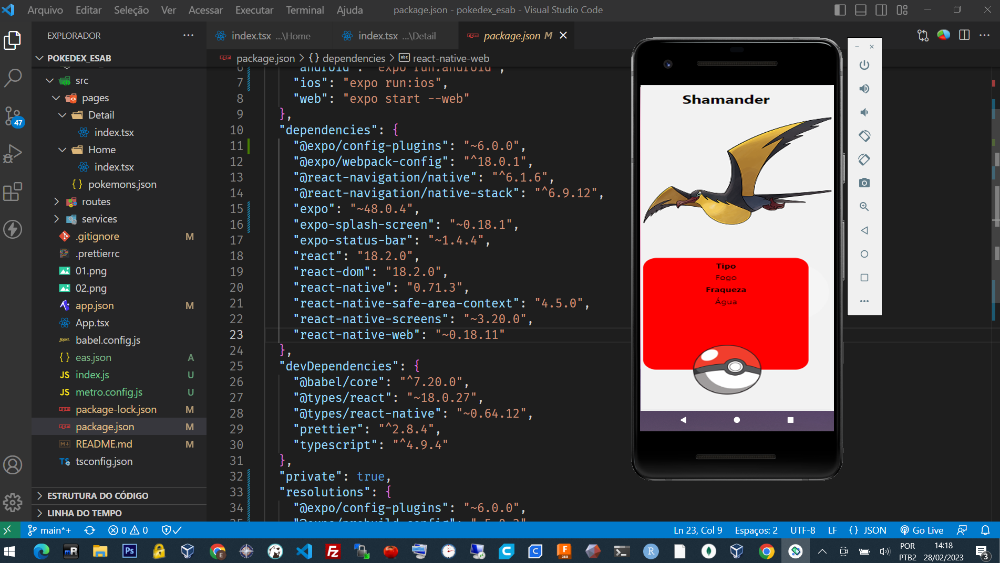
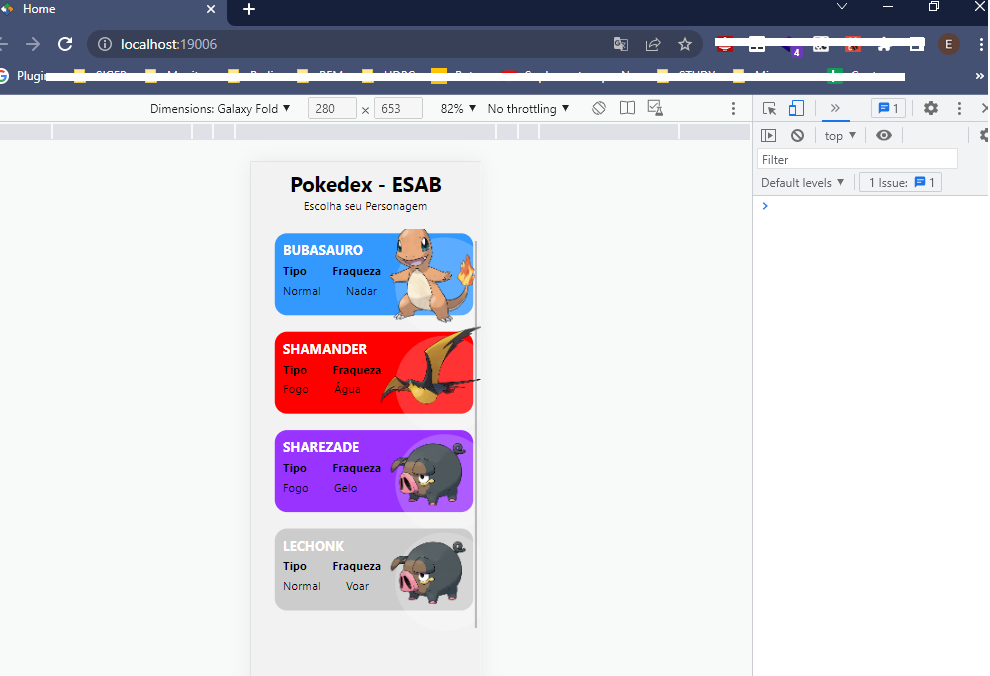
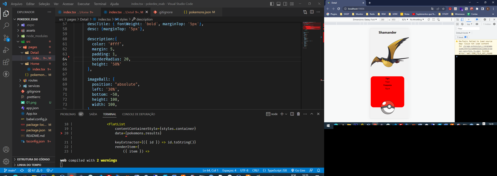

#POKEDEX - Trabalho ESAB 

Projeto criado utilizando o Android Studio com React-Native.

<table>
    <tr>
        <td></td>
        <td></td>
    </tr>

    <tr>
        <td></td>
        <td></td>
    </tr>
   
</table>

&nbsp;

